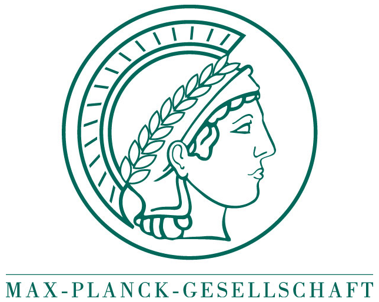

# About

## About the Open PHD Guiding Project

The Open PHD Guiding project began in 2009 when Craig Stark of [Stark Labs][1], the author of PHD Guiding and Nebulosity, released the source code of his popular PHD Guiding application. In 2012 the project was picked up by Bret McKee who did a major refactoring of the code, reworking much of the internal infrastructure and introducing the multi-threaded architecture in use by the application today.

In 2013 the project maintenance role transitioned to the current maintainers, Andy Galasso and Bruce Waddington, who have overseen the development of the application since then. The application today is the result of contributions from more than 40 developers and translators. See Help – About in the PHD2 menu for the full list of contributors.

Developers interested in working on the project are encouraged to send pull requests via the [PHD2 project page on github][2], and to participate in the [PHD2 Forum][3]. Additional information for developers is available in the [PHD2 Wiki][4].

We are also looking for translators to [translate PHD2][5] and to keep the existing non-English translations up to date.

If you are an experienced PHD2 user, we would sincerely appreciate your help advising and supporting newer users in the PHD2 forum.

The developers would like to add a special acknowledgement of the contribution of the Predictive PEC guide algorithm by the team at the Max Planck Institute, Intelligent Systems. This contribution from the academic community highlights a benefit of developing astronomy software within a collaborative, non-commercial framework.

{ align=left; width=25% } [Max Planck Institute, Intelligent Systems, Tübingen, Germany][6]

- Edgar Klenske (Empirical Inference, Probabilistic Numerics)
- Raffi Enficiaud (Software Workshop)
- Stephan Wenninger (Software Workshop)

- PEC guiding
- Transition to CMake

[1]: http://stark-labs.com/
[2]: https://github.com/OpenPHDGuiding/phd2
[3]: https://groups.google.com/forum/?fromgroups=#!forum/open-phd-guiding
[4]: https://github.com/OpenPHDGuiding/phd2/wiki
[5]: https://github.com/OpenPHDGuiding/phd2/wiki/TranslatingPHD2
[6]: https://is.tuebingen.mpg.de/
