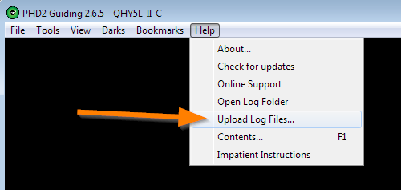
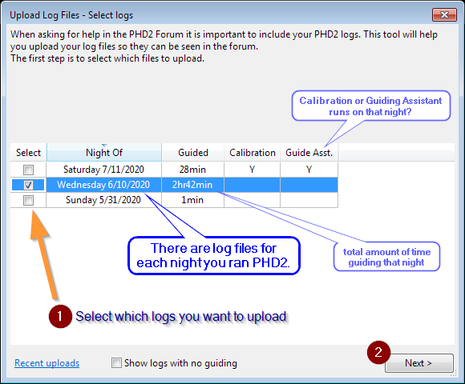
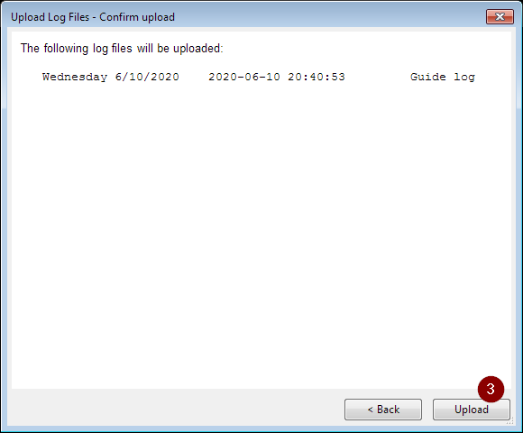
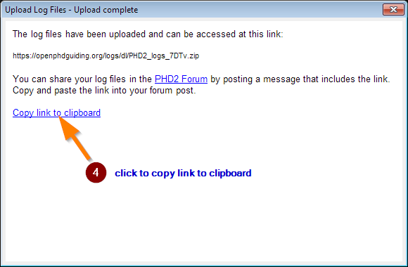

# Getting Help

## Resources for Self-Help

Answers to common questions about PHD2 can be found in the [Troubleshooting section][1] of the PHD2 Help or in the [PHD2 Best Practices][2] guide.

There are also several very informative in-depth videos done by the authors that will advance your understanding and help you get the most from PHD2:

- Guiding Basics: <https://www.youtube.com/watch?v=ty8hukjAPMw>
- Optimizing Guiding: <https://www.youtube.com/watch?v=ifbLY6Q-cN8>
- Understanding PHD2 Calibration: <https://www.youtube.com/watch?v=MzjyjEpDW90>

## How to ask for help with PHD2

If you still can’t find the answer to your question you can ask for help in the [PHD2 Forum][3].

When you post, make sure to include your PHD2 Log Files by using PHD2’s built-in Log Uploader feature. A step by step guide to using this feature and attaching logs to your post is below.

A few tips on common questions regarding logs:

- Log files are always created when PHD2 is run, regardless of what was done (or not done) during the time that PHD2 was running, so you will have log files to support a request for help. You do not need to enable logging, and it cannot be disabled. (However, you can set the folder your logs are saved to in Advanced Settings).
- PHD2 automatically removes debug logs that are more than 30 days old and guide logs that are more than 60 days old. If you want to retain the files for longer periods, you should move or copy them to a different folder location, one not used by PHD2.
- The debug log is always much larger than the guidelog. Please do not attempt to upload a debug log directly to a forum post, it usually exceeds the maximum file limit. Use PHD2’s built-in Log Uploader feature, which will automatically include both the guidelog and the debug log.
- Do not copy and paste fragments of your log file or attach log excerpts with your own analysis. We need to see the entire log file(s). If you want to add your observations please write them in the body of your message and still include your complete logs.
- If your post doesn’t go through immediately, it may be queued for review (especially if this is your first post). Please be patient, it may take a day or two.

## Log File upload Step-by-step

Uploading logs is a built-in feature of PHD2. To access it, choose “Upload Log Files…” from the Help menu:

{ width="75%" }

Select the log files to upload. Use the day/date in the Night Of column to identify the PHD2 session you would like us to look at.

{ width="75%" }

Confirm and click Upload

{ width="75%" }

Copy the link to the clipboard

{ width="75%" }

Compose your message in the [PHD2 Forum][1] and paste the log file link into the message (Ctrl-V). Please include any additional detail that you think might help us help you. For example, let us know the approximate time of the problem so we know where to start looking in the log. The logs will show us everything that PHD2 was doing and any errors that occurred, but there are other aspects of your setup that may be relevant that are not included in the log.

[1]: /manual/?section=Trouble_shooting.htm
[2]: blog/posts/phd2-best-practices.md
[3]: https://groups.google.com/forum/?fromgroups=#!forum/open-phd-guiding
[4]: https://groups.google.com/forum/?fromgroups=#!forum/open-phd-guiding

Sample post:

> Tonight I got an unexpected error message when I calibrated at around 9:30 pm. Here are my log files: https://openphdguiding.org/logs/dl/PHD2_logs_7DTv.zip
