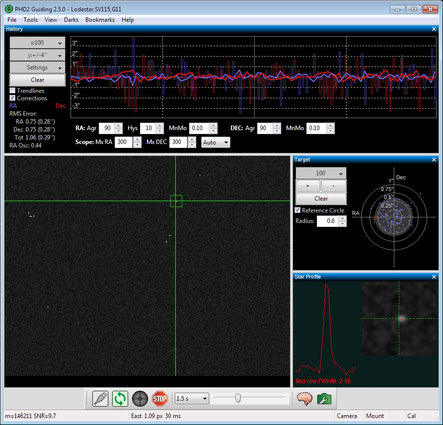
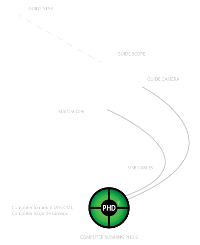

## Open PHD Guiding – Official Website for PHD2

PHD2 is telescope guiding software that simplifies the process of tracking a guide star, letting you concentrate on other aspects of deep-sky imaging or spectroscopy.

{ width="75%" }

- Easy-to-use, “push here dummy” guiding for beginners
- Sophisticated guiding and analysis tools for experienced users
- Extensive support for commonly-used equipment
- Easy upgrade/co-installation with PHD1, including many new features
- Available for Windows, Mac, and Linux
- Extensive online help and responsive product support

{ width="75%" }

## Getting started

PHD2 comes with a built-in help file, which is an excellent way to get started with PHD2.
You can access the help file from the Help menu in PHD2, or you can view or download the manual here: [HTML][1] | [PDF][2].

For questions about using the application, general troubleshooting, bug reports, feature requests, and questions about PHD2 development, please post on the [Open PHD Guiding][3] Google group.

Please read [How to ask for help with PHD2][4] for tips on how to ask for help with a guiding problem or to report an issue with PHD2.

[1]: /manual/?section=Introduction.htm
[2]: /PHD2_User_Guide.pdf
[3]: https://groups.google.com/forum/#!forum/open-phd-guiding
[4]: getting-help.md
