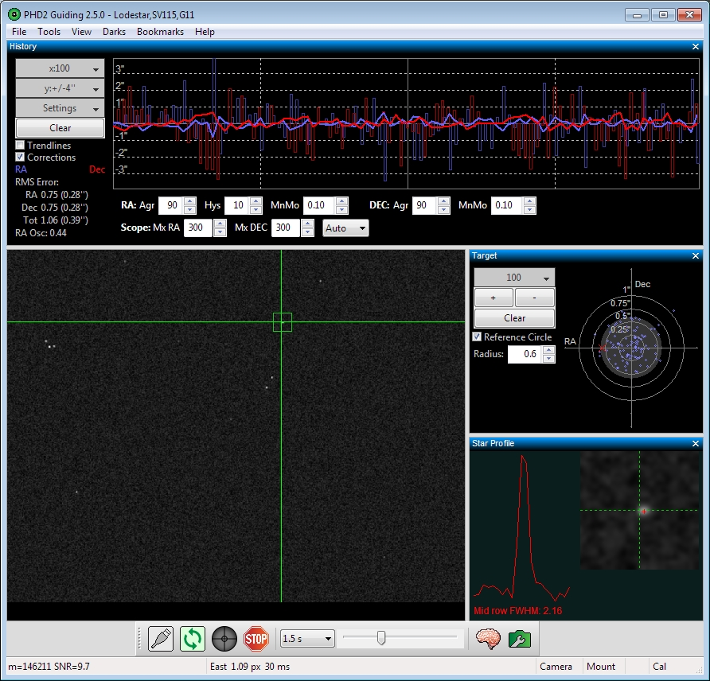
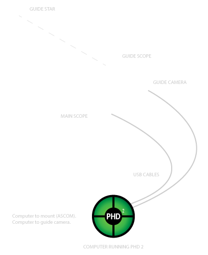

## Open PHD Guiding – Official Website for PHD2

PHD2 is telescope guiding software that simplifies the process of tracking a guide star, letting you concentrate on other aspects of deep-sky imaging or spectroscopy.

{ width="75%" }

PHD2 is the next generation of guiding software for amateurs of all experience levels

### For beginning imagers

- Setup wizard to get guiding started with just a few mouse-clicks
- Extensive support for commonly-used equipment
- Smart calibration with automatic adjustment for side-of-pier and pointing location
- Intelligent default settings for out-of-the-box results
- Tools for drift alignment and comet-tracking
- Proactive suggestions and advisory messages to improve your guiding

### For more experienced imagers

- Multiple algorithm choices for each telescope axis
- Guiding Assistant for measuring mount performance
- Extensive visualization tools for fine-tuning and review
- Automatic management of dark-frame libraries and bad-pixel maps
- Quick and easy switching between multiple imaging configurations
- Support for adaptive optics and rotator devices
- Automation interfaces for 3rd party imaging apps

{ width="75%" }

## Getting started

PHD2 comes with a built-in help file, which is an excellent way to get started with PHD2.
You can access the help file from the Help menu in PHD2, or you can view or download the manual here: [HTML][1] | [PDF][2].

For questions about using the application, general troubleshooting, bug reports, feature requests, and questions about PHD2 development, please post on the [Open PHD Guiding][3] Google group.

Please read [How to ask for help with PHD2][4] for tips on how to ask for help with a guiding problem or to report an issue with PHD2.

[1]: /manual/?section=Introduction.htm
[2]: /PHD2_User_Guide.pdf
[3]: https://groups.google.com/forum/#!forum/open-phd-guiding
[4]: getting-help.md
